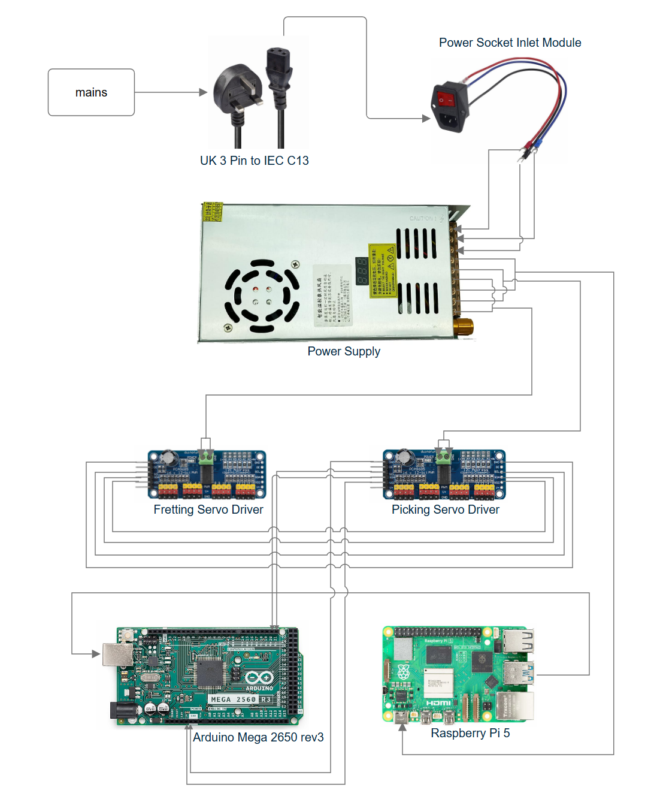

# Important Note
In its current state, the Raspberry Pi does not have the software installed. I set up a fresh copy of the OS, anticipating that future users (students working on a capstone project) would iterate on it from a clean slate. As a result, the Raspberry Pi is not ready for immediate use and will need some time for software installation and setup. 

However, everything else should be in place. The Arduino should already contain the required sketch, and most of the wires should be connected.

Thus, to get the autonomous guitar working, you need:
1. Disassemble the housing.
2. Insert the microSD card into the Raspberry Pi.
3. Set up the Pi’s software (you may need a keyboard and mouse for this).
4. Connect the Pi and two servo drivers to the Power Supply.
5. Set the Power Supply to 5 V.

# 1. Introduction
The Autonomous Guitar is a proof-of-concept mechatronic instrument that can pick, strum and fret a standard six-string guitar without human hands. Six servos stroke the strings above the sound-hole, while twelve micro-servos press frets along the neck.

An Arduino Mega 2560 drives the servos in real time via two PCA9685 PWM boards; a Raspberry Pi 5 schedules musical events, hosts a small Flask web app, and sends packets to the Arduino over USB serial. 

All firmware, Python code and wiring diagrams are open-source so others can extend the system. In short, this guide shows you how to power up, install the software and have the guitar play itself.

# 2.  Bill of Materials

| Qty | Item                               | Notes                                                 |
| --- | ---------------------------------- | ----------------------------------------------------- |
| 1   | Classical/acoustic guitar          | Holes drilled to attach picking unit                  |
| 6   | Servos (picking)                   |                                                       |
| 12  | Servos (fretting)                  |                                                       |
| 2   | PCA9685 16‑channel PWM boards      | I²C addresses 0x40 & 0x41                             |
| 1   | Arduino Mega 2560                  | USB cable for Pi connection                           |
| 1   | Raspberry Pi 5 (+ micro‑SD, power) | Runs Flask web app                                    |
| 1   | 5 V power supply                   | IMPORTANT: Must be set to around 5 V to work properly |

# 3. Electronics & Wiring
## 3.1. Power Topology
- 5 V supply → PCA9685 external +ve and -ve screw terminals → servos.
- Pi USB-C may be fed by the SMPS or its own PSU
- Grounds: tie Pi GND, Arduino GND, servo GND together.

## 3.2. Connections
A diagram is given below.

### Switched-Mode Power Supply (SMPS)
A shared power rail (on Power Supply) powers two driver boards and the Raspberry Pi

| From         | To         | Notes    |
| ------------ | ---------- | -------- |
| Mains Outlet | IEC Module |          |
| IEC inlet L  | SMPS L     | Switched |
| IEC inlet N  | SMPS N     |          |
| IEC inlet E  | SMPS E     | Earth    |

### Fretting Servo Driver
The Fretting Servo Driver uses external 5 V DC power from the Power Supply and receives I2C data and logic 5V from the Picking Servo Driver (daisy-chained).

| From             | To      | Notes         |
| ---------------- | ------- | ------------- |
| Arduino SDA (20) | SDA     | I²C data      |
| Arduino SCL (21) | SCL     | I²C clock     |
| Arduino 5 V      | VCC     | Logic only    |
| SMPS Output +ve  | EXT +ve | Servo power   |
| SMPS Output -ve  | EXT -ve | Common return |

### Picking Servo Driver
The Picking Servo Driver uses external 5 V DC power from the Power Supply and receives I2C data and logic 5V from the Arduino. The Picking Servo Driver also sends I2C data and logic 5V to the Fretting Servo Driver.

| From              | To      | Notes       |
| ----------------- | ------- | ----------- |
| Picking Servo SDA | SDA     | Daisy-chain |
| Picking Servo SCL | SCL     |             |
| Picking Servo VCC | VCC     |             |
| Picking Servo GND | GND     |             |
| SMPS Output +ve   | EXT +ve | Servo power |
| SMPS Output -ve   | EXT -ve |             |

### Arduino Mega
The Arduino Mega has a serial connection with the Raspberry Pi and sends I2C signals to the servo driver boards.

| From               | To            | Notes       |
| ------------------ | ------------- | ----------- |
| Raspberry Pi USB A | Arduino USB B | Serial data |

### Raspberry Pi
The Raspberry Pi receives 5V power from the Power Supply via a USB C cable and serial commands to the Arduino.

| From            | To      | Notes |     |
| --------------- | ------- | ----- | --- |
| SMPS Output +ve | EXT +ve | Power |     |
| SMPS Output -ve | EXT -ve |       |     |


If Pi instability is observed, it can also be powered by a dedicated USB-C wall adaptor.

### Wiring Diagram


## 3.3. I²C Addressing
*This step should already be done, but I am leaving it here just in case.*

| Board | Function        | A0  | A1  | A2  | I²C address |
| ----- | --------------- | --- | --- | --- | ----------- |
| **0** | Fretting servos | 0   | 0   | 0   | `0x40`      |
| **1** | Picking servos  | 1   | 0   | 0   | `0x41`      |

## 3.4. Servo Channel Map

|Logical index|Function|Board|Channel|
|--:|---|--:|--:|
|0 – 5|Picking strings e A D G B E|1|0–5|
|6 – 11|Fretting (lower half)|0|0–5|
|12 – 17|Fretting (upper half)|0|6–11|

# 4. Firmware Upload (Arduino Mega)

*These steps should already be done (i.e., the Arduino should already be set up), but I am leaving them here just in case.*

1. **Install Arduino IDE**

 Download at: https://www.arduino.cc/en/software/

3. **Copy the supplied libraries**

The repository already contains patched versions of the required libraries:
```
Autonomous-Guitar/
└─ Arduino/
   ├─ libraries/
   │   ├─ Adafruit_PWM_Servo_Driver_Library
   │   ├─ RemoteControl
   │   └─ ServoControl
   └─ RemoteScheduler/RemoteScheduler.ino
```

To download code from GitHub, click **Code → Download ZIP**

3. **Locate your local Arduino libraries folder**

_Windows_: `Documents\Arduino\libraries`  
_macOS/Linux_: `~/Arduino/libraries`

5. **Install required libraries**

Drag-and-drop everything inside `Autonomous-Guitar/Arduino/libraries/` into that folder

7. **Open the sketch**

In the IDE choose **File → Open…** and select: 
`Autonomous-Guitar/Arduino/RemoteScheduler/RemoteScheduler.ino`

9. **Select board and port**
- **Tools → Board** → _Arduino Mega or Mega 2560_
- **Tools → Processor** → _ATmega2560 (Mega 2560)_
- **Tools → Port** – pick the **serial/USB port** that appears when you plug the Mega in (e.g. `COM4` on Windows, `/dev/ttyACM0` on Linux).

7. **Compile & upload**
- Click **✓ Verify** – the sketch should compile without warnings.
- Click **→ Upload** – flashing takes a few seconds.
On success the IDE shows **“Done uploading.”**

7. **Confirm serial output**
- Open **Tools → Serial Monitor**.
- Set **baud = 115200** and **line ending = “Newline”**.
- You should see: `RemoteControl: Servo drivers initialised.`

# 5. Software Installation (Raspberry Pi)
 1. **Flash Raspberry Pi OS & enable SSH / serial**

*This step should already be done, but I am leaving it here just in case.*

Refer to this webpage for more info: https://www.raspberrypi.com/documentation/computers/getting-started.html#installing-the-operating-system

2. **Enable the touchscreen in the config**

*This step should already be done, but I am leaving it here just in case.*

Refer to this webpage for more info: https://www.waveshare.com/wiki/5inch_DSI_LCD#Method_1:_Use_Raspberry_Pi_Imager_to_Flash_Latest_Official_Image

Open microSD card on a laptop and edit the `config.txt` in the root directory. At the end of the config, add the following.
```
dtoverlay=vc4-kms-v3d
#DSI1 Use
dtoverlay=vc4-kms-dsi-7inch
#DSI0 Use（Only Pi5/CM4）
#dtoverlay=vc4-kms-dsi-7inch,dsi0
```

 3. **Install Pi dependencies**
```
# Update the operating system
sudo apt update && sudo apt full-upgrade -y
sudo apt install python3-venv

#Reboot the system
sudo reboot
```

 4. **Get the code**
```
# Clone the full repository
git clone https://github.com/DDingoose/Autonomous-Guitar.git
cd Autonomous-Guitar/RasPi
```

If you cannot use Git, click **Code → Download ZIP** on GitHub then copy the `RasPi` folder to the Pi and continue in that directory.

5. **Install Python dependencies**
```
pip install -r requirements.txt
```

This installs flask and pyserial.

6. **Start Flask server**
```
# Run web app
python app.py
```

You should see: `Running on http://<Pi-IP-address>:5000/ (Press CTRL+C to quit)`

7. **Launch web app in Chromium**
```
# Launch Chromium in kiosk mode (full screen)
chromium-browser --kiosk <Pi-IP-address>:5000

# For example, for IP address 127.0.0.1:
chromium-browser --kiosk 127.0.0.1:5000
```

8. **(Optional) Enable autostart on boot**

Create `/etc/systemd/system/autonomous-guitar.service`:
```
[Unit]
Description=Autonomous Guitar Web App
After=network.target

[Service]
User=pi
WorkingDirectory=/home/pi/Autonomous-Guitar/RasPi
ExecStart=/home/pi/Autonomous-Guitar/RasPi/venv/bin/python app.py
Restart=on-failure

[Install]
WantedBy=multi-user.target
```

```
sudo systemctl daemon-reload
sudo systemctl enable --now autonomous-guitar
```

9. **Copy / edit user assets**
- `songs/` – place your song JSON files here.
- `static/` – front-end HTML/JS/CSS. Adjust if you customise the web UI.
- `calibration.json` – update neutral/press/release angles to match your own servos.

# 6. Playing a Song
*These steps should already be done, but I am leaving them here just in case.*

| Step | Action           | Command / Click                                                                                                                      | What to expect                                                                                                                                   |
| ---- | ---------------- | ------------------------------------------------------------------------------------------------------------------------------------ | ------------------------------------------------------------------------------------------------------------------------------------------------ |
| 1    | Choose a score   | On the touchscreen (or any browser) open **http:// <pi-ip>:5000** → drop-down list shows all `songs/*.json` files.                   | The title and duration appear under the **Play** button.                                                                                         |
| 2    | Start playback   | Press **Play** (UI)  **or**`curl -X POST -H "Content-Type: application/json" \` `-d '{"song":"Fur_Elise"}' http://<pi-ip>:5000/play` | The progress bar stays at 0 % for ≈1 s while the Pi and Arduino synchronise, then advances in real time. Servos begin to move on the first beat. |
| 3    | Monitor progress | Blue ring grows from 0–100 %. **Status** endpoint shows JSON: `{"state":"playing","pct":0.42}`.                                      | If anything stalls, tap **Stop** or send the stop call below.                                                                                    |
| 4    | Stop / reset     | Press **Stop** (UI)  **or**`curl -X POST http://<pi-ip>:5000/stop`                                                                   | The Pi transmits **STOP** + **RESET** packets; all servos return to their neutral angles. `DONE` prints on the Arduino serial monitor.           |
## 6.1. Adding or replacing songs
1. Create a new `<name>.json` file that follows the existing schema (`timeline`, optional `sections`).
2. Copy it into the `songs/` folder on the Pi (`scp`, `git pull`, or the web editor).
3. Refresh the web page. Your song will appear in the drop-down.

# 7. Troubleshooting
## 7.1. General diagnostic routine
1. **Power** – Confirm 5.0 ± 0.1 V on the V+ rail _with servos energised_.
2. **USB** – Re-insert the Arduino cable; wait for `/dev/ttyACM0` to re-appear.
3. **Serial monitor** (`115200 baud`) – look for `STOPPED`, `RESET_DONE`, `DONE`, or buffer errors.
4. **Log the Pi console** – run `python app.py` from SSH to watch scheduling output live.

| Symptom (what you see / hear)                                                     | Likely cause                                              | Quick check                                                           | Fix                                                                                                   |
| --------------------------------------------------------------------------------- | --------------------------------------------------------- | --------------------------------------------------------------------- | ----------------------------------------------------------------------------------------------------- |
| “**RemoteControl: Servo drivers initialised.**” _never appears in Serial Monitor_ | SDA/SCL swapped or PCA9685 not powered                    | Multimeter: 5 V on PCA boards; continuity on SDA/SCL pins             | Re-seat JST / Dupont leads; verify board at address 0×41 (picking) has A0 jumper soldered.            |
| **Servos twitch or chatter at power-on**                                          | No RESET packet from Pi; calibration angles wrong         | Serial monitor shows no “RESET_DONE”; check `calibration.json` values | Press **Stop** in the web UI or run `curl -X POST <pi>/stop`; correct neutral angles and re-start.    |
| **“ERROR: command buffer full”** on Arduino                                       | Pi is sending events faster than the Arduino can schedule | `WINDOW_MS` too large or song too dense                               | Reduce `WINDOW_MS` in `scheduler.py` (e.g. 5000 ms); shorten the JSON timeline; split complex chords. |
| **Flask banner appears, but page 404s** when pressing **Play**                    | Song filename mismatch                                    | `ls songs/*.json`                                                     | Use the dropdown list; omit the `.json` suffix in the POST body.                                      |
| **Some frets never press fully**                                                  | Wrong servo mapping or channel unplugged                  | `RemoteScheduler.ino` mapping table lines 1–18                        | Trace the wire to the correct PCA9685 channel; update `addServo()` indices if hardware changed.       |
| **Pi shows “Address already in use”**                                             | `app.py` already running (duplicate instance)             | `ps aux                                                               | grep app.py`                                                                                          |

# 8. Calibration
## 8.1. JSON Layout
```
{
  "picking": {
    "e": {          // low-E string pick servo (index 0)
      "neutral": 92,
      "up":      70,
      "down":   115
    },
    "A": { … },
    …
  },
  "fretting": {
    "e": {          // fretting servos on the low-E string
      "neutral": { "6": 88, "12": 87 },        // neutral by servo index
      "frets": {
        "1": { "press": 104, "release": 88 },
        "2": { "press": 118, "release": 88 },
        …
      }
    },
    …
  }
}
```

- **neutral:** angle that just clears the string when idle
- **up / down:** picking stroke limits (alternating each pluck)
- **press / release:** fret angles for each fret number

Servo indices 0-5 = picking (board 1 channels 0-5) 6-17 = fretting (board 0 channels 0-11).

## 8.2 Picking Servo Calibration
| Task               | How                                                                                                                                                                                                      |
| ------------------ | -------------------------------------------------------------------------------------------------------------------------------------------------------------------------------------------------------- |
| **1. Neutral**     | Edit `picking.<string>.neutral`. Run the `RESET` song). The pick should hover a few mm clear of the string.                                                                                              |
| **2. Down-stroke** | Create/modify a one-line song file, or use the `TEST_ROUTINE` song, which tests every possible note for all six strings and four frets. Ensure the pick moves past the string for all fret combinations. |
| **3. Up-stroke**   | Same as above                                                                                                                                                                                            |
| **4. Repeat**      | Do the same for strings A-D-G-B-high E.                                                                                                                                                                  |
## 8.3 Fretting Servo Calibration
| Task                 | How                                                                                                                                                                                                                                                              |
| -------------------- | ---------------------------------------------------------------------------------------------------------------------------------------------------------------------------------------------------------------------------------------------------------------- |
| **1. Neutral**       | In `fretting.<string>.neutral.<idx>` set a value so the pad sits 1-2 mm clear of the string.Play the `RESET` song to check clearance.                                                                                                                            |
| **2. Press angle**   | Choose a note, e.g. low-E 3rd fret. Edit `frets."3".press` for that string. Start with `neutral + 15`. Make a quick test song or use the `TEST_ROUTINE` song, which tests every possible note for all six strings and four frets. Listen for buzz or dead note.  |
| **3. Release angle** | Set `release = neutral` unless you need the finger to stay closer to the fret (rare).                                                                                                                                                                            |
| **4. Repeat**        | Work through every string/fret combo you care about.                                                                                                                                                                                                             |

# 9. Known Issues
- Raspberry Pi brownouts
- Touchscreen sometimes does not work – restarting Pi usually fixes this

